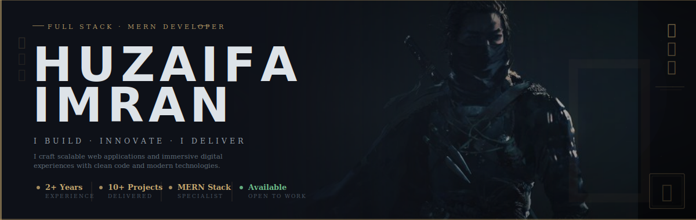
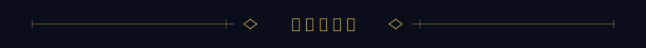
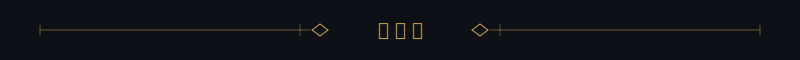
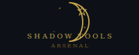
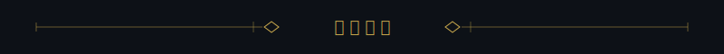
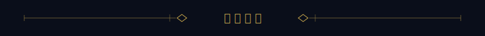

<!--
  ╔══════════════════════════════════════════════════════════════════════╗
  ║        HUZAIFA.IMRAN — GitHub Profile README                        ║
  ║        Ghost of Tsushima · Full Cinematic Edition                   ║
  ╚══════════════════════════════════════════════════════════════════════╝
-->

<div align="center">
  
</div>

<br/>

<!---------------------------------------------------------------------------->
<!--  I. THE OATH  -->
<!---------------------------------------------------------------------------->

<div align="center">

<br/>

*The wind carries no name. The shadow leaves no trace.*
*Yet the work remains — written in code, etched in commit.*

<br/>

```
　 　　　　影　の　侍　　｜　　S H A D O W　S A M U R A I　　｜　　影　の　侍 　　　　
```

</div>

<br/>

<!---------------------------------------------------------------------------->
<!--  II. THE SCROLL — ABOUT  -->
<!---------------------------------------------------------------------------->

<div align="center">



### *WHO IS THE SHADOW*

</div>

<br/>

```ts
const jin = {
  name    : "Huzaifa Imran",
  clan    : "Full Stack MERN · 3D Worlds · AI Systems",
  weapons : ["React", "Next.js", "Node.js", "TypeScript", "PostgreSQL", "Unreal Engine 5"],
  creed   : "Code is not about solving problems — it is about creating possibilities.",
  status  : "⚔  Available · Open to new quests",
  locale  : "Faisalabad, Pakistan 🇵🇰",
};
```

<br/>

<div align="center">

> *"He who builds in silence speaks loudest when the work is revealed."*

<br/>

[](https://port-folio-bb21.vercel.app)
[](https://linkedin.com/in/huzaifaimran-sungpog)
[](mailto:smart_huzaifa@outlook.com)

</div>

<br/><br/>

<!---------------------------------------------------------------------------->
<!--  III. THE ARSENAL  -->
<!---------------------------------------------------------------------------->

<div align="center">



### *THE ARSENAL*

<br/>

*Every tool a blade. Every commit a cut.*

<br/>

*Every tool a blade. Every commit a cut.*

<br/>

<div align="center">

</div>

<p align="center">

</p>

<br/>

<div align="center">

</div>

<p align="center">

</p>

<br/>

<div align="center">

</div>

<p align="center">

</p>

</div>

<br/><br/>

<!---------------------------------------------------------------------------->
<!--  IV. THE CHRONICLES — FEATURED PROJECTS  -->
<!---------------------------------------------------------------------------->

<div align="center">



### *CHRONICLES OF BATTLE*

<br/>

*Three quests. Three victories. The samurai does not count his wars — only his scars.*

</div>

<br/>

---

### ⚔ &nbsp; [IMPACTTRACKER](https://github.com/Huzaifa-12Imran/ImpactTracker) &nbsp;`·`&nbsp; *The Oracle of Open Source*

> *"To measure what others ignore — that is the mark of a true strategist."*

An AI-driven engine that tracks and scores the **social impact of open-source projects**. Deep-scan contributor analysis, geographic impact mapping, and community health scoring — light cast into the darkness where invisible effort lives unrecognised.


&nbsp;&nbsp;⭐ **3** &nbsp;·&nbsp; 🍴 **1** &nbsp;·&nbsp; MIT License

---

### 🏯 &nbsp; [COREBANKING SYSTEM](https://github.com/Huzaifa-12Imran/CoreBankingSystem) &nbsp;`·`&nbsp; *The Iron Fortress*

> *"The strongest castle is built not in a day, but in a thousand careful transactions."*

Enterprise-grade Core Banking System built with **PostgreSQL 17 and Node.js**. Advanced PL/SQL automation, ACID-compliant transactions, and a premium Zinc-style Bento dashboard — a fortress raised transaction by transaction, immovable, precise, eternal.


&nbsp;&nbsp;⭐ **1** &nbsp;·&nbsp; PLpgSQL

---

### 🌙 &nbsp; [NEXUS MAIL](https://github.com/Huzaifa-12Imran/Nexus-Mail) &nbsp;`·`&nbsp; *The Messenger Who Never Sleeps*

> *"Words are arrows. The wise man sends them with intention."*

A **Gmail Clone powered by AI** — intelligent email assistance woven into every keystroke. Where ancient scrolls meet machine intuition. The messenger who reads between the lines, so you never have to.


&nbsp;&nbsp;⭐ **2** &nbsp;·&nbsp; TypeScript

---

<br/><br/>

<!---------------------------------------------------------------------------->
<!--  V. BATTLE RECORDS — REAL STATS  -->
<!---------------------------------------------------------------------------->

<div align="center">



### *BATTLE RECORDS*

<br/>

*The Chronicle does not lie. Every line committed. Every quest completed.*

<br/>


<br/>


</div>

<br/><br/>

<!---------------------------------------------------------------------------->
<!--  VI. HONORS  -->
<!---------------------------------------------------------------------------->

<div align="center">


### *HONORS OF THE CLAN*

<br/>

*The clan remembers those who persisted.*

<br/>


</div>

<br/><br/>

<!---------------------------------------------------------------------------->
<!--  VII. THE FAREWELL  -->
<!---------------------------------------------------------------------------->

<div align="center">

```
　　　　　　　　　　　　　　　　　　　　　　　　　　　
　　A　samurai　does　not　fear　the　blank　page.　
　　He　only　fears　the　day　he　stops　writing.　
　　　　　　　　　　　　　　　　　　　　　　　　　　　
```

*— Huzaifa Imran &nbsp;·&nbsp; 影の侍 &nbsp;·&nbsp; Shadow Samurai*

<br/>


</div>
