# Huzaifa Imran

**MERN · Unreal Engine 5 · Blender · C++ · Assembly** 
Software Engineering @ FAST-NUCES '28 — Faisalabad, Pakistan

---

Two things I do that most devs don't do together: **ship full-stack web apps** and **build 3D worlds in Unreal Engine**. The overlap makes me think about performance, depth, and experience differently than someone who only lives in one domain.

---

### contribution calendar — in 3D

<!-- GitHub Action generates this — see .github/workflows/metrics.yml -->

### snake eats my commits

---

---

*Open to internships · freelance · full-time* 
**Let's build something that looks as good as it runs.**

